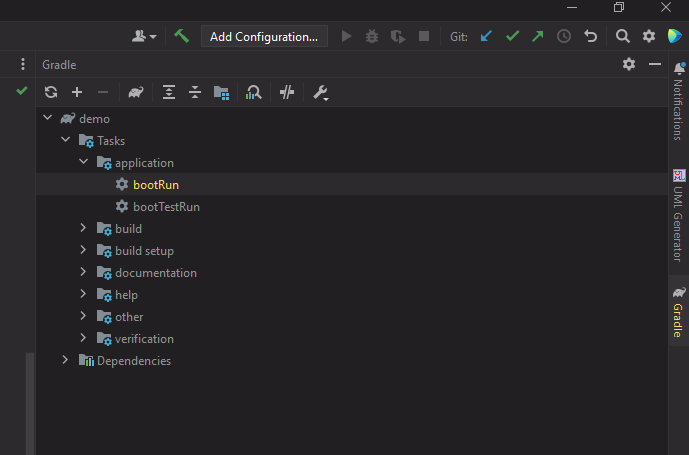
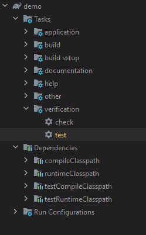

# About this project

Project to setup a backend service with Gradle, Springboot and Postgres.

## Project

 - Using Gradle 8.7

```aidl
java --version
java 17.0.1 2021-10-19 LTS
Java(TM) SE Runtime Environment (build 17.0.1+12-LTS-39)
Java HotSpot(TM) 64-Bit Server VM (build 17.0.1+12-LTS-39, mixed mode, sharing)
```

## Database

For ease of development, we rely on docker desktop to start a Postgres instance. 
Details are available in docker-compose.yml

```aidl
docker compose up dev-db
```

## Running the application



Check the build.gradle file to see dependencies required.

We can run the application by using the IDE action "bootRun" as seen in the image above.

Or we can also do:

```
./gradlew bootRun
```


## Running the tests

Check the build.gradle file to see dependencies required.



We can run the application by using the IDE action "verification" -> "test" as seen in the image 
above.
